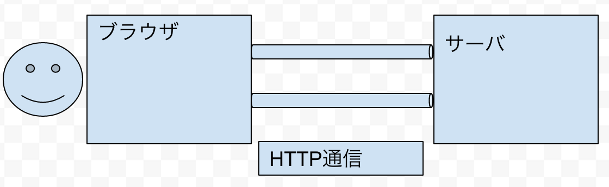

<!-- page_number: true -->

# webアプリケーション
* webアプリケーションとは
* webアプリケーションのしくみ
* webページの構成

---

## webアプリケーションとは
* ブラウザ上で利用するアプリケーション

---

## webアプリケーションのしくみ
* クライアントとサーバ
  * クライアント
    * ブラウザ
  * サーバ
    * アプリケーションの本体

* クライアントの世界とサーバの世界をhttp通信を介してやりとりする
* 処理イメージ
  1. クライアントがサーバ(URL)にアクセス
  1. サーバがhtmlをクライアントに渡す
  1. ブラウザがhtmlを解析し描画

---

## webページの構成
* 登場人物
  * html
    * webページの構造を作る
  * css
    * webページのレイアウトを整える
  * javascript
    * webページに動きを与える

---
