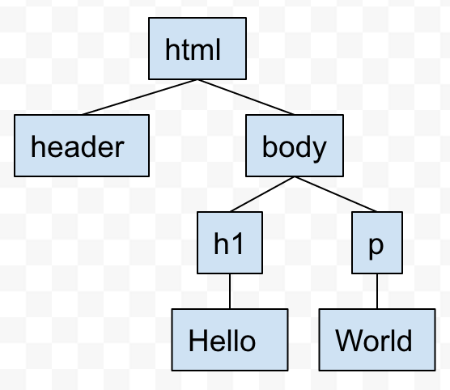

<!-- page_number: true -->

# html
* htmlとは
* htmlファイルの構造
* よく使うタグ

---

## htmlとは
* htmlとは
  * Hyper Text Markup Language
  * webページの構造を組み立てる言語
* 特徴
  * タグ形式
    * <タグ>テキスト</タグ>
  * ツリー構造
  * 大文字小文字の区別はない(一般的に小文字で書く)
```html
<html>
  <head>
  </head>
  <body>
    <h1>Hello</h1>
    <p>World</p>
  </body>
</html>
```


---

## htmlファイルの構造
* ドキュメントタイプ
  * 冒頭でhtmlファイルであることを宣言する
  * `<!DOCTYPE html>`
* head
  * htmlファイルの付随情報を記述する
* body
  * htmlファイルの本体(画面に表示される部分)を記述する
* コメント
  * `<!-- コメント -->`
```html
<!DOCTYOE html>
<html>
  <head>
    <!-- titleはブラウザのタブに表示されます -->
    <title>javascript研修</title>
    <!-- 日本語の文字化けを防ぐために文字コードを指定しておきます -->
    <meta charset="utf-8" />
  </head>
  <body>
    <h1>Hello</h1>
    <p>World</p>
  </body>
</html>
```

---

## よく使うタグ
* h1とか
* tableとか
* form系
* ボタン
* リスト
* リンク

---
